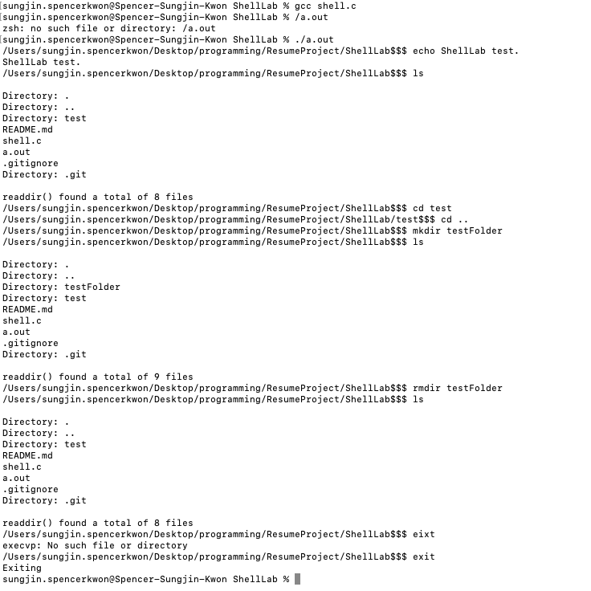
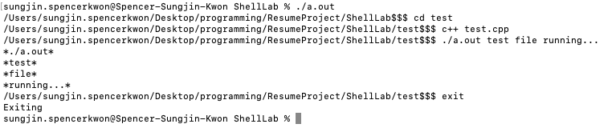

# Shell Lap Project

## Development Objectives.

1. Implementing following shell-command.

   echo, ls, cd, mkdir, rmdir

2. Implementing to run any other executable in the same directory, and run the executable it finds the proper files.

---

## Result.

1. running shell-command using shell.c

2. running other executable.

